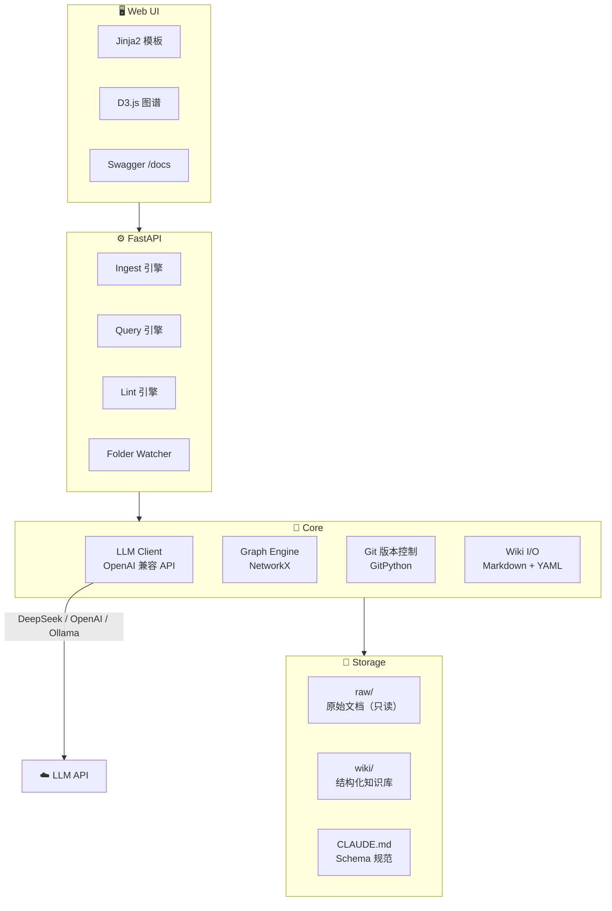

# LLM Wiki

> 用 LLM 把散落的文档变成持续生长的结构化 Wiki。
>
> Based on [Karpathy's LLM Wiki](https://gist.github.com/karpathy/442a6bf555914893e9891c11519de94f) concept.

---

## 是什么

传统 RAG 每次问问题都要重新检索原始文档、拼凑答案。LLM Wiki 的思路不同：**让 LLM 提前把知识编译成结构化 Wiki，然后基于 Wiki 回答问题**。知识累积起来，而不是每次都从头造。

```
原始文档  →  LLM 阅读 & 提取  →  结构化 Markdown Wiki  →  查询 / 浏览 / 图谱
(raw/)                         (wiki/)                   (Web UI / API)
```

你负责提供资料、提问、做判断。LLM 负责所有繁琐的整理、交叉引用、更新维护。

---

## 快速开始

### 1. 安装

```bash
git clone <repo-url> && cd llm-wiki
poetry install
```

### 2. 配置 LLM

```bash
cp .env.example .env
# 编辑 .env，填入你的 API Key
```

支持任何 OpenAI 兼容接口（OpenAI / DeepSeek / Ollama / LM Studio 等）：

```env
LLM_API_BASE=https://api.openai.com/v1
LLM_API_KEY=sk-your-key-here
LLM_MODEL=gpt-4o
LLM_SMALL_MODEL=gpt-4o-mini   # 轻量任务用小模型，省钱
```

### 3. 启动

```bash
poetry run uvicorn app.main:app --port 8089
```

打开 **http://127.0.0.1:8089**

---

## 使用流程

```
┌──────────┐     ┌──────────┐     ┌──────────┐     ┌──────────┐
│ 放入源文档 │ ──→ │  Ingest  │ ──→ │  浏览Wiki │ ──→ │ Query查询 │
│  raw/     │     │  /ingest │     │    /      │     │  /query   │
└──────────┘     └──────────┘     └──────────┘     └──────────┘
                       │                                 │
                       ↓                                 ↓
                LLM 提取知识                       基于 Wiki 回答
                生成/更新页面                       带 [[引用]]
                更新 index.md
                追加 log.md
                git commit
```

### 放入源文档

```bash
# 把文档放在 raw/ 目录
cp your-paper.md raw/
```

### 执行 Ingest

打开 `/ingest` 页面，输入源文档文件名，点击执行。或通过 API：

```bash
curl -X POST http://127.0.0.1:8089/api/wiki/ingest \
  -H "Content-Type: application/json" \
  -d '{"source_path": "transformer-paper.md"}'
```

### 浏览 Wiki

| 页面 | 路由 | 功能 |
|------|------|------|
| Wiki 浏览器 | `/` | 查看所有页面，点击 [[wikilink]] 跳转 |
| 图谱视图 | `/graph` | D3.js 力导向图，拖拽缩放搜索 |
| Ingest 面板 | `/ingest` | 上传/粘贴文档，Dry-run 预览 |
| Query 对话 | `/query` | 基于 Wiki 问答，带来源引用 |
| Lint 仪表盘 | `/lint` | 矛盾/死链/孤立页检测，一键修复 |
| 分支管理 | `/branches` | Git 分支创建/切换/合并 |
| API 文档 | `/docs` | Swagger UI，所有 API 可在线测试 |

---

## 项目结构

```
llm-wiki/
├── raw/                   ← 原始资料（只读）
├── wiki/                  ← LLM 生成的 Wiki（Markdown + Git 版本管理）
│   ├── index.md           ← 页面目录
│   └── log.md             ← 操作时间线
├── CLAUDE.md              ← LLM 行为规范（Schema）
│
├── core/                  ← 基础设施
│   ├── config.py          ← 配置管理
│   ├── llm.py             ← LLM 客户端（OpenAI 兼容 + 重试）
│   ├── git.py             ← Git 操作封装
│   ├── graph_engine.py    ← NetworkX 图谱引擎
│   └── wiki_io.py         ← 文件 I/O + index + log
│
├── api/                   ← 业务逻辑 + API 路由
│   ├── wiki.py            ← ingest / query / lint 核心
│   ├── entity.py          ← 实体管理
│   ├── graph.py           ← 图谱 API
│   ├── impact.py          ← 影响分析
│   ├── branch.py          ← 分支管理
│   └── webhook.py         ← GitHub Webhook
│
├── app/main.py            ← FastAPI 入口
├── templates/             ← Jinja2 前端页面
├── static/css/style.css   ← 暗色主题
├── tests/                 ← 测试
└── docs/                  ← 需求 & 任务文档
```

---

## API 概览

| 方法 | 端点 | 说明 |
|------|------|------|
| `POST` | `/api/wiki/ingest` | 摄入源文档 |
| `POST` | `/api/wiki/ingest/batch` | 批量摄入 |
| `POST` | `/api/wiki/query` | 查询 Wiki |
| `POST` | `/api/wiki/lint` | 健康检查 |
| `GET` | `/api/wiki/pages` | 列出页面 |
| `GET` | `/api/wiki/pages/{name}` | 获取页面 |
| `PUT` | `/api/wiki/pages/{name}` | 更新页面 |
| `DELETE` | `/api/wiki/pages/{name}` | 删除页面 |
| `GET` | `/api/wiki/index` | 获取索引 |
| `GET` | `/api/wiki/log` | 获取日志 |
| `GET` | `/api/entities` | 实体列表 |
| `GET` | `/api/graph` | 图数据 |
| `GET` | `/api/graph/paths` | 路径查找 |
| `POST` | `/api/impact/analyze` | 影响分析 |
| `GET/POST` | `/api/branches` | 分支管理 |
| `POST` | `/api/webhook/github` | GitHub 集成 |

完整文档：`/docs` (Swagger UI)

---

## Lint 健康检查

`/lint` 页面提供 Wiki 质量自动化诊断，分为两层检查 + 一个综合评分。

### 一、结构化检查（基于图谱）

| 检查项 | 类型 | 级别 | 说明 |
|--------|------|------|------|
| 孤立页面 | `orphan` | ⚠️ warning | 入链为 0，没有被任何页面引用 |
| 死链 | `dead_link` | 🔴 critical | `[[wikilink]]` 指向不存在的页面 |

### 二、源文件完整性检查

| 检查项 | 类型 | 级别 | 说明 |
|--------|------|------|------|
| 源文件已修改 | `source_integrity` | ⚠️ warning | `raw/` 中的文件自上次 ingest 后被修改，Wiki 内容可能过时 |

### 三、LLM 语义检查

采样最多 10 个 Wiki 页面，交由 LLM 审查是否存在内容矛盾、信息过时、格式问题、缺失交叉引用等语义层面的质量问题。LLM 返回的 issue 级别可为 `critical` / `warning` / `info`。

### 四、健康评分（A–F）

仅按 **critical** 和 **warning** 数量计算（`info` 级别不影响评分）：

| 评分 | 条件 |
|------|------|
| **A** 🟢 | 0 critical + 0 warning — Wiki 完全健康 |
| **B** 🟢 | 0 critical，warning ≤ 3 |
| **C** 🟡 | critical ≤ 2 |
| **D** 🟠 | critical ≤ 5 |
| **F** 🔴 | critical > 5 |

### 自动修复

点击 "🔧 运行并自动修复" 时，仅自动处理 **死链**：为目标页面创建 stub（占位）页面，标记为 `draft` 状态。其他问题需手动处理。

---

## 开发

```bash
# 运行测试
poetry run pytest tests/ -v

# 开发模式启动（热重载）
poetry run uvicorn app.main:app --reload --port 8089
```

详见 `docs/requirements.md`（需求）和 `docs/tasks.md`（任务拆解）。

---

## 核心理念

> *"The tedious part of maintaining a knowledge base is not the reading or the thinking — it's the bookkeeping. LLMs don't get bored, don't forget to update a cross-reference, and can touch 15 files in one pass."*
>
> — Andrej Karpathy

---

## 技术栈

### 架构总览



### 各层技术选型

| 层级 | 技术 | 选型理由 |
|------|------|----------|
| **Web 框架** | FastAPI + Uvicorn | 异步高性能、自动生成 Swagger 文档、类型安全 |
| **模板引擎** | Jinja2 | 轻量、与 FastAPI 深度集成、支持模板继承 |
| **图谱可视化** | D3.js (力导向图) | 交互式拖拽缩放、支持搜索高亮、纯前端渲染 |
| **图谱引擎** | NetworkX (DiGraph) | Python 最成熟的图算法库、支持路径查找/中心度/孤立检测 |
| **LLM 客户端** | OpenAI SDK | 兼容所有 OpenAI 格式 API（DeepSeek / OpenAI / Ollama / LM Studio） |
| **LLM 模型** | DeepSeek V4 Pro（大模型）+ GPT-4o-mini（小模型） | 大模型做 ingest/lint 复杂任务，小模型做 query/摘要，节约成本 |
| **Token 估算** | tiktoken | 调用前估算上下文用量，防止超出预算 |
| **版本控制** | Git (GitPython) | 每次 ingest 自动 commit，支持分支实验 → 审核 → 合并 |
| **数据存储** | Markdown 文件 + YAML frontmatter | 纯文本、人类可读、兼容 Obsidian、Git 友好 |
| **配置管理** | Pydantic Settings + .env | 类型校验、环境变量覆盖、settings.json Web UI 热更新 |
| **文件夹监听** | watchfiles | 高效文件系统事件监控，自动触发 ingest |
| **异步 I/O** | aiofiles | 非阻塞文件读写，不阻塞 FastAPI 事件循环 |
| **CSS 主题** | CSS 变量 + data-theme | 深色/浅色一键切换、跟随系统偏好、localStorage 持久化 |

### 实体关系抽取流程

```
源文档 (raw/*.md)
    │
    ▼
┌─────────────────────────────────────┐
│  LLM Ingest Prompt                  │
│  ├─ 注入 CLAUDE.md Schema           │
│  ├─ 注入已有 Wiki 页面（最多 50 页）  │
│  └─ JSON Mode 严格输出               │
└─────────────────────────────────────┘
    │
    ▼
┌─────────────────────────────────────┐
│  LLM 输出 (structured JSON)         │
│  ├─ source_summary: 文档摘要         │
│  ├─ new_pages[]: 实体页 + 概念页     │
│  │   └─ 内容含 [[wikilink]] 交叉引用  │
│  ├─ updated_pages[]: 需更新的旧页    │
│  ├─ contradictions[]: 矛盾标注       │
│  └─ relationships[]: 关系类型声明     │
└─────────────────────────────────────┘
    │
    ▼
┌─────────────────────────────────────┐
│  Graph Engine (NetworkX)            │
│  ├─ 正则解析 [[wikilink]] → 有向边   │
│  ├─ frontmatter relations → 类型边   │
│  └─ 支持: 反向链接 / 孤立检测 / 路径  │
└─────────────────────────────────────┘
```

### 页面类型体系

| 类型 | 用途 | 命名示例 |
|------|------|----------|
| `entity` | 具体事物：模型、人物、论文、工具 | `Transformer.md` |
| `concept` | 抽象概念或技术 | `Self-Attention.md` |
| `source_summary` | 消化后的源文档摘要 | `transformer-paper.md` |
| `overview` | 跨来源的综合主题 | `Overview-LLM-Architecture.md` |
| `comparison` | 并排对比 | `GPT-vs-BERT.md` |

### 关系类型

| 类型 | 含义 | 示例 |
|------|------|------|
| `references` | A 引用了 B（默认 wikilink） | `[[Transformer]]` → `[[Self-Attention]]` |
| `supports` | A 的证据支持 B 的结论 | 新实验 → 旧假设 |
| `contradicts` | A 的结论与 B 冲突 | 新论文 → 旧结论 |
| `extends` | A 在 B 基础上扩展 | `Multi-Head Attention` → `Self-Attention` |
| `supersedes` | A 取代了 B | 新版方法 → 旧版方法 |
